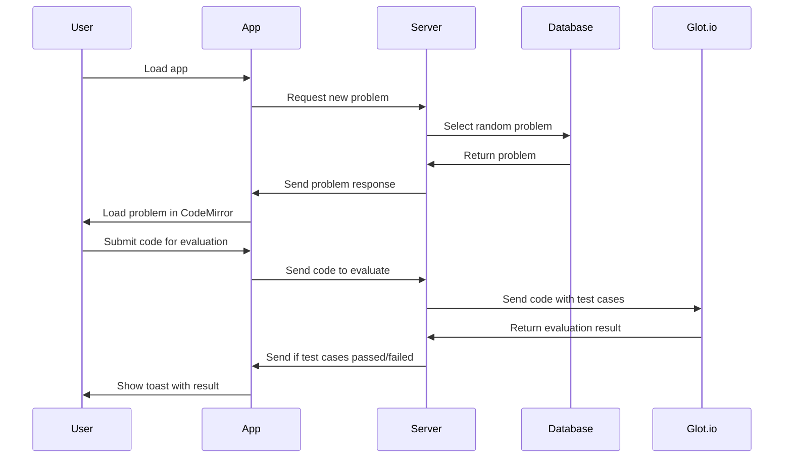

# Usage

To run the server:

```bash
cd server
npm start
```

To run the client:

```bash
cd client
npm start
```

# Main Flow Sequence Diagram
<!-- 1. User loads app.
2. App sends request to get new problem.
3. Server selects random problem from database.
4. Server sends response with problem.
5. App loads problem into CodeMirror instance.
6. User sends request to evaluate code.
7. Server sends code with test cases to Glot.
8. Server gets response from Glot.
9. Server sends response if test cases passed / failed.
10. App shows toast with result. -->



# Architecture Decision Record

| Chosen Technology | Alternatives Considered | Reasons for Choice |
|-------------------|-------------------------|--------------------|
| React             | Svelte, Vue, Angular    | - **Svelte**: Limited third-party support and smaller community.<br>- **Vue**: Prefers single-file components, conflicting with the desire for smaller files.<br>- **Angular**: Verbose and complex for simpler project needs. |
| CodeMirror        | Monaco                  | - **Monaco**: Heavier and more complex than CodeMirror.<br> |
| Glot              | Judge0, Repl.it         | - **Judge0**: Requires more setup and configuration than Glot.<br>- **Repl.it**: More focused on providing an online IDE than code evaluation. |
| Non-Relational Database | Relational Database | - **Evolutionary Nature**: Matches the inherent evolutionary nature of software development, allowing for flexible, agile adaptations. |
| MongoDB | Cassandra, Redis, Neo4j | - **Document-Oriented Model**: Easily stores coding problems and their multiple test cases in a flexible, JSON-like structure. <br> - **Ease of Setup with MongoDB Atlas**: Quick and straightforward cloud setup with Atlas, eliminating complex configuration tasks. <br> - **Proven Effectiveness**: Widespread adoption suggests reliability and effectiveness for a variety of applications. |

# TODO

- [x] File structure of app?
- [x] File structure of server?